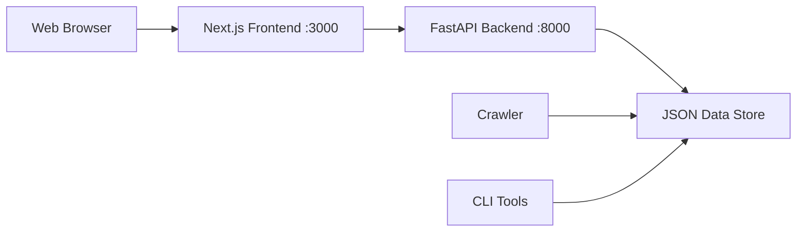

# 📁 Project Overview

## 🏗 Architecture

Current Stack is a modern monorepo with a clean separation between API and web frontend:

```
current/
├── 🔌 app/                    # FastAPI Backend
│   ├── main.py               # API server & routes
│   ├── crawler.py            # Stack data crawler
│   ├── storage.py            # Data persistence
│   ├── models.py             # Data models
│   ├── requirements.txt      # Python dependencies
│   └── Dockerfile           # API container config
│
├── 🌐 web/                    # Next.js Frontend
│   ├── pages/               # Next.js pages
│   ├── components/          # React components
│   ├── styles/              # Tailwind CSS
│   ├── package.json         # Node dependencies
│   └── Dockerfile           # Web container config
│
├── 🐳 docker-compose.yml      # Multi-service setup
├── 📊 insomnia-collection.json # API testing collection
├── 🚀 start-local.sh          # Quick start script
├── 🛑 stop-local.sh           # Clean shutdown script
└── 📖 SELF_HOSTING_GUIDE.md   # Detailed setup guide
```

## 🔄 Data Flow



## 🛠 Tech Stack

### Backend (API)

- **FastAPI** - Modern Python web framework
- **Uvicorn** - ASGI server
- **Pydantic** - Data validation
- **Requests** - HTTP client for crawling
- **Schedule** - Task scheduling

### Frontend (Web)

- **Next.js** - React framework
- **Tailwind CSS** - Utility-first styling
- **Framer Motion** - Smooth animations
- **TypeScript** - Type safety

### Infrastructure

- **Docker** - Containerization
- **Docker Compose** - Multi-service orchestration
- **OrbStack** - Efficient container runtime

## 🎯 Key Features

### API Features

- **RESTful endpoints** for stack data
- **Real-time search** with fuzzy matching
- **Health monitoring** with `/ready` endpoint
- **Auto-documentation** with FastAPI/Swagger
- **Data persistence** with JSON storage
- **Automated crawling** of stack popularity

### Web Features

- **Responsive design** for all devices
- **Interactive search** with instant results
- **Beautiful animations** and transitions
- **Stack categorization** and filtering
- **Modern UI components** with Tailwind

### Development Features

- **Hot reload** for both frontend and backend
- **Docker-based** development environment
- **API testing** with Insomnia collection
- **Simple deployment** with Docker Compose
- **Persistent data** between container restarts

## 🔧 Development Workflow

1. **Start Services**: `./start-local.sh`
2. **Make Changes**: Edit files in `app/` or `web/`
3. **Test API**: Use Insomnia collection
4. **View Changes**: Auto-reload in browser
5. **Stop Services**: `./stop-local.sh`

## 📈 Scaling Options

### Horizontal Scaling

```bash
# Scale API instances
docker-compose up --scale api=3

# Scale web instances
docker-compose up --scale web=2
```

### Load Balancing

- Add nginx reverse proxy
- Configure multiple API instances
- Use Docker Swarm or Kubernetes

### Database Migration

- Replace JSON storage with PostgreSQL
- Add Redis for caching
- Implement proper migrations

## 🚀 Deployment Options

### Local Development

- Docker Compose with hot reload
- OrbStack for efficient containers
- Insomnia for API testing

### Production Self-Hosting

- Same Docker Compose setup
- Environment variable configuration
- Reverse proxy for SSL/domains

### Cloud Deployment

- Any Docker-compatible platform
- Kubernetes clusters
- Container registries

## 🔍 Monitoring & Debugging

### Health Checks

- API: `http://localhost:8000/ready`
- Web: `http://localhost:3000`

### Logs

```bash
# All services
docker-compose logs -f

# Specific service
docker-compose logs -f api
```

### Data Inspection

- API docs: `http://localhost:8000/docs`
- Data files: `./app/data/`
- Container inspection: `docker-compose ps`

## 🎨 Customization

### Adding New Stacks

1. Edit `app/crawler.py`
2. Add new data sources
3. Update crawling logic
4. Restart API service

### UI Modifications

1. Edit components in `web/components/`
2. Update styles in `web/styles/`
3. Changes auto-reload in browser

### API Extensions

1. Add new endpoints in `app/main.py`
2. Update models in `app/models.py`
3. Test with Insomnia collection
